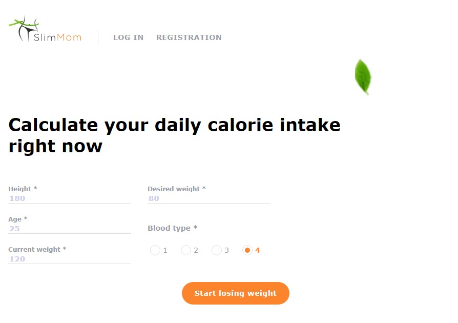
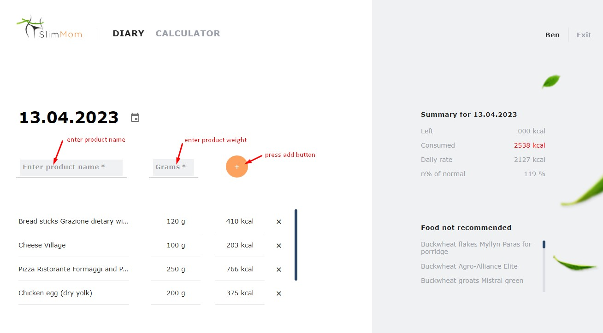

# SlimMom-frontend Application

The application helps to keep track of the calories of the food eaten. Based on
the data provided by the user, the appliction calculates the daily caloric
intake and provides a list of products not recommended for consumption.

## Usage

- follow the [link](https://ancasab.github.io/SlimMom-frontend/) to get started
- fill out the form and click "Start losing weight"  
   
- added a new product and its weight  
  

## Created with

:white_check_mark: React  
:white_check_mark: Redux Toolkit  
:white_check_mark: HTML  
:white_check_mark: SASS  
:white_check_mark: Webpack  
:white_check_mark: REST API

# React template

This project was created with
[Create React App](https://github.com/facebook/create-react-app). To get
acquainted and configure additional features
[refer to documentation](https://facebook.github.io/create-react-app/docs/getting-started).
